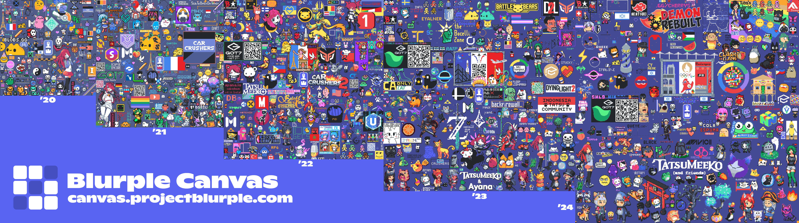

# Blurple Canvas
This is a Discord Bot that runs the Blurple Canvas event within Project Blurple. 

Blurple Canvas is an event where users can place pixels on a canvas, and collaborate with others to create art. The canvas is shared across communities to a diverse collage of pixel art. 

The bot is coded in **Python** using the **Discord.py** library, and stores data using **PostgreSQL**.

## Check us out!
- [Blurple Canvas Web](https://canvas.projectblurple.com)
- [Project Blurple](https://discord.gg/blurple)

